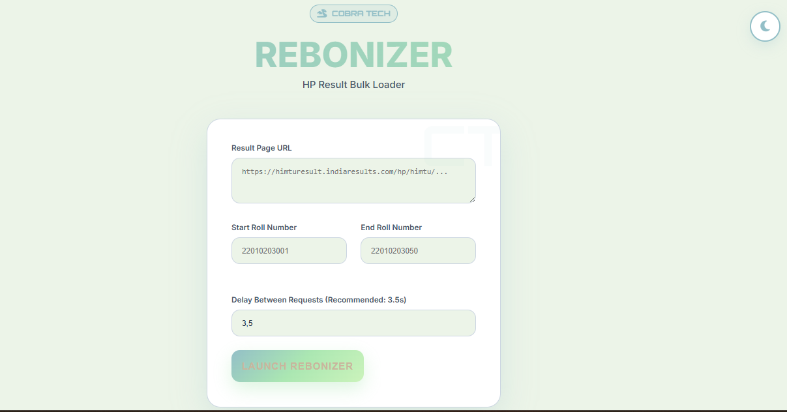
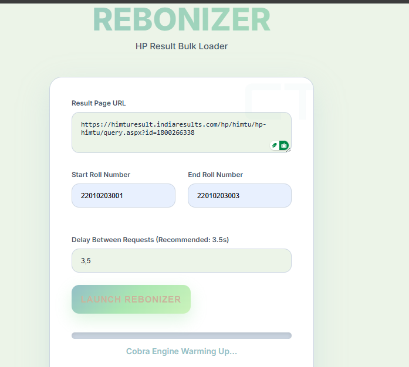

# REBONIZER v7 – COBRA TECH OFFICIAL EDITION

**Team: COBRA TECH (CT)**  
**Colors: #ECF4E8 • #CBF3BB • #ABE7B2 • #93BFC7**  
**Smooth Toggle • Premium UI • Final & Perfect**

REBONIZER is a Flask-based web tool for bulk scraping and exporting student results from HP university result pages (e.g., IndiaResults). It uses Selenium for automation, parses data with BeautifulSoup, and generates formatted Excel reports with OpenPyXL. Supports up to 100 roll numbers per batch with configurable delays to respect rate limits.

## Features
- **Premium UI**: Dark/Light theme toggle, smooth animations, responsive design.
- **Bulk Scraping**: Enter URL, roll range, and delay – auto-generates Excel.
- **Smart Parsing**: Extracts name, grades, SGPA/CGPA, supply subjects.
- **Export**: Downloadable XLSX with frozen headers and styled cells.
- **Error Handling**: Graceful fallbacks for missing data.

## Screenshots

### Light Theme UI


###  INPUT DATA 



## Installation

1. Clone the repo:
git clone https://github.com/nickrajput716/rebonizer.git
cd rebonizer
text2. Create a virtual environment (recommended):
python -m venv venv
source venv/bin/activate  # On Windows: venv\Scripts\activate
text3. Install dependencies:
pip install -r requirements.txt
text4. Run the app:
python app.py
text- Access at `http://127.0.0.1:5000`
- ChromeDriver auto-installs via `webdriver-manager`.

## Usage

1. **Input Data**:
- Paste the result page URL (e.g., `https://himturesult.indiaresults.com/hp/himtu/...`).
- Enter start/end roll numbers (max 100).
- Set delay (recommended: 3.5s to avoid bans).

2. **Launch**:
- Click "LAUNCH REBONIZER".
- Confirm the scrape (shows estimated time).

3. **Output**:
- Progress bar updates in real-time.
- On success: Auto-downloads `CT_REBONIZER_[start]_to_[end]_[YYYYMMDD].xlsx`.
- Excel includes: Roll, Name, Subjects (with credits), SGPA/CGPA, Status, Supplies.

**Note**: Use responsibly – respect website ToS and rate limits. Headless Chrome runs in background.

## Project Structure

```
rebonizer/
├── app.py                 # Main Flask app entrypoint
├── scraper.py             # Selenium scraper logic
├── requirements.txt       # Dependencies
├── .gitignore             # Git ignore rules
├── README.md              # This file
├── templates/
│   └── index.html         # Main UI template
└── static/
    ├── css/
    │   └── style.css      # Extracted CSS
    └── js/
        └── script.js      # Extracted JS
└── screenshots/           
    ├── ui-light.png       # Placeholder UI
    ├── ui-dark.png
    ├── progress.png
    └── excel-sample.png
```

text## Contributing
- Fork, PR, or issues welcome!
- Tech: Python 3.8+, Flask, Selenium.

## License
MIT License – © 2025 COBRA TECH (Nikhil Rana).

**Made with ❤️ by Nikhil Rana**
